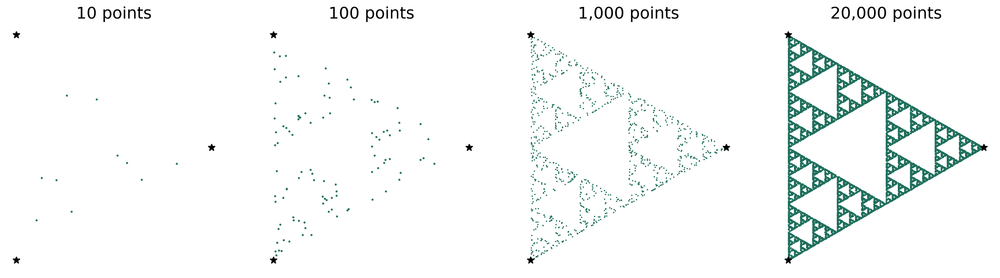
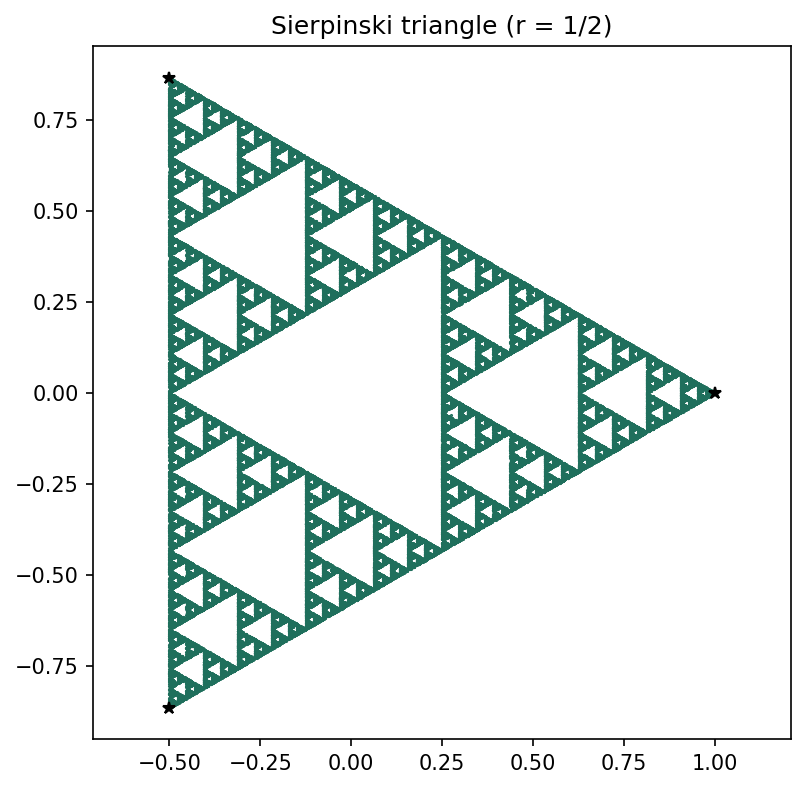
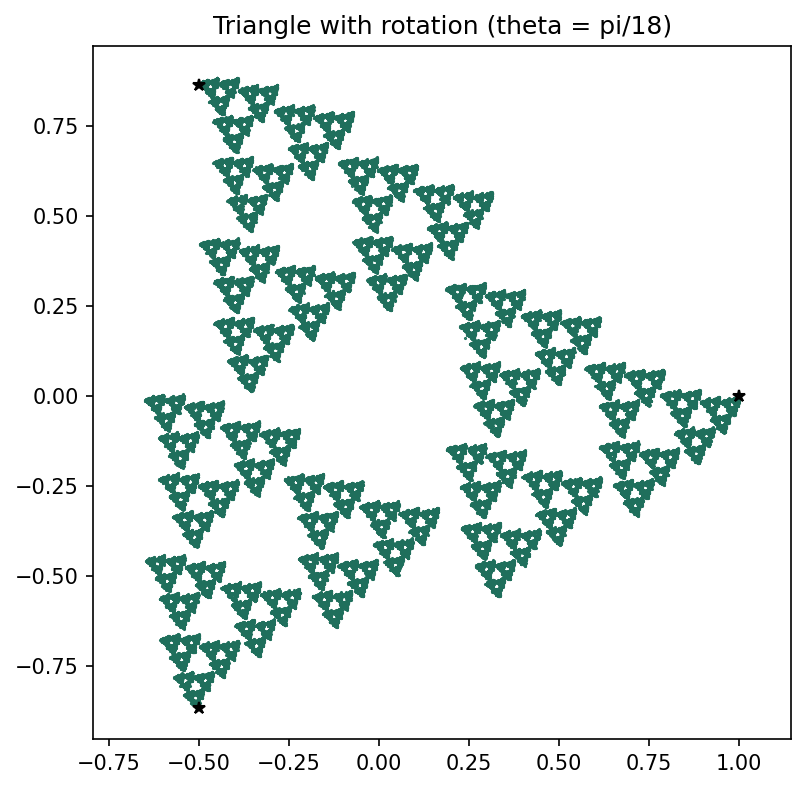
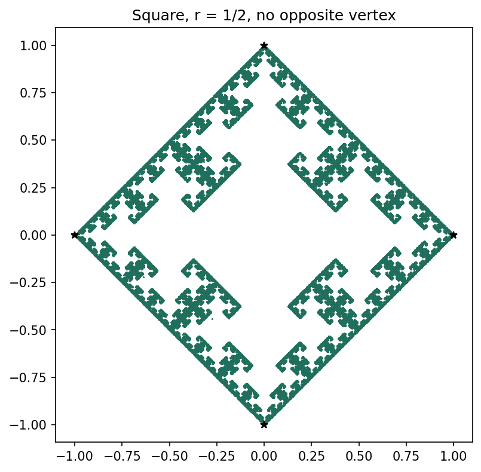
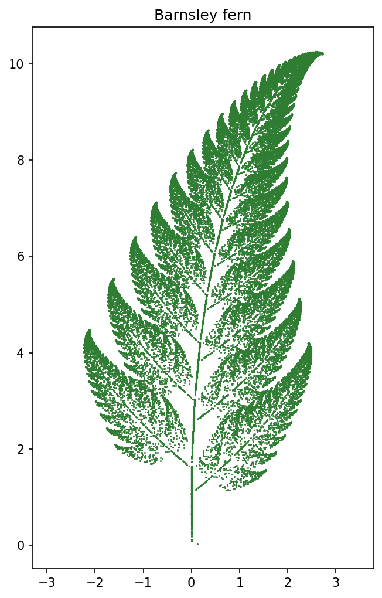
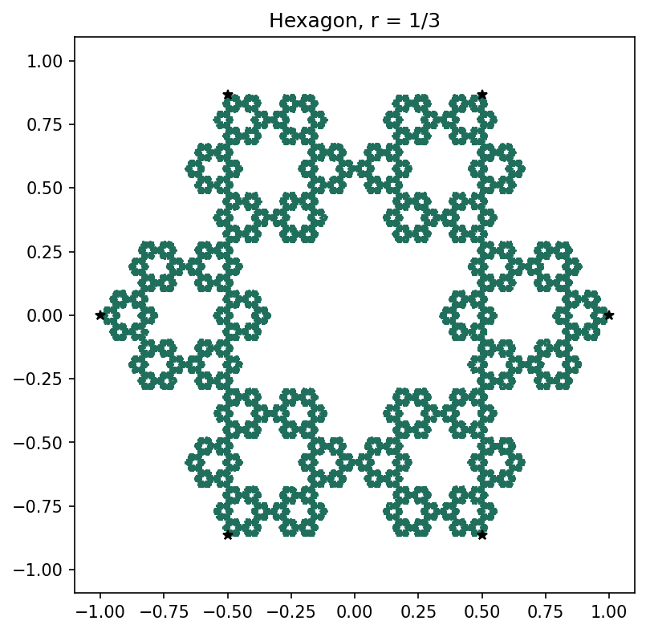
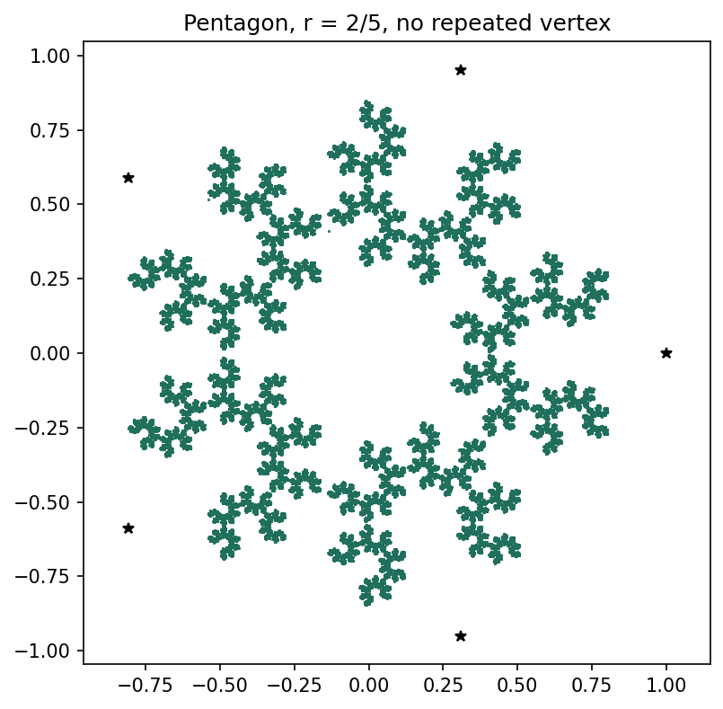

# Chaos Game: Fractals from Linear Maps

MFAD Mini Project. We generate fractals (Sierpinski triangle, Barnsley fern and others) by repeatedly applying
linear / affine maps of the plane, and analyse them with linear algebra: determinants, eigenvalues and
fractal dimension.

## The idea
Pick vertices `v_1..v_n` of a regular polygon and a ratio `r`. Start at a random point `x`, then repeat:
choose a vertex `v` at random and move

    x_new = T (x - v) + v,      T = r * I

Each step is a contraction toward the chosen vertex by factor `r`. Plotting thousands of points reveals the
attractor of the system. Rotations (`T = r * R(theta)`), restrictions on which vertex may be picked next, and
non-uniform affine maps `x -> T x + Q` (Barnsley fern) give different fractals.

## Linear algebra used
- Matrix-vector multiplication and affine maps of R^2 (scaling, rotation, translation)
- Determinant of `T` = factor by which areas shrink
- Eigenvalues of `T` = long-run shrinking/stretching directions (all have modulus < 1, so the iteration contracts)
- Singular matrix (`T4` in the fern) collapses the plane onto a line, which produces the fern's stem
- Discrete dynamical systems: `x_{k+1} = f(x_k)` iterated to an attractor

## Setup and run
```bash
git clone <your-repo-url>
cd chaos-game
python -m venv venv && source venv/bin/activate      # Windows: venv\Scripts\activate
pip install -r requirements.txt
python main.py            # saves all figures to figures/ and prints the analysis
python main.py --show     # same, but also opens each figure window (live demo)
python visuals.py         # step diagram, build-up strip and chaos_game.gif for the slides
```

## Files
| File | Purpose |
|---|---|
| `chaos_game.py` | Library: polygons, maps, the game, restriction rules, Barnsley fern |
| `main.py` | Generates all figures and prints the dimension / eigenvalue analysis |
| `visuals.py` | Makes the step diagram, build-up strip and an animated GIF of the triangle forming |
| `figures/` | Output images (open `chaos_game.gif` in a browser to watch it build) |
| `slides/` | Project presentation (PowerPoint) |

## Results



*Same rule, more points: 10, 100, 1,000 and 20,000.*

| | | |
|---|---|---|
|  |  |  |
| Sierpinski triangle, r=1/2 | with rotation | square, no opposite vertex |
|  |  |  |
| Barnsley fern | hexagon, r=1/3 | pentagon, r=2/5, no repeat |

### Fractal dimension (box counting vs theory `log n / log(1/r)`)
| Case | Measured | Theory |
|---|---|---|
| Triangle, r=1/2 | 1.597 | 1.585 |
| Triangle, r=1/3 | 1.016 | 1.000 |
| Square, r=1/3 | 1.330 | 1.262 |
| Hexagon, r=1/3 | 1.629 | 1.631 |

### Observations
- Square with r=1/2 fills the whole square (no fractal). Forbidding the opposite vertex produces one.
- Theory matches measurement when the pieces don't overlap; box counting is rougher where they nearly touch.
- Fern map determinants: 0.72, -0.11, 0.10, 0 (area shrink per map); the stem comes from the singular `T4`.

## Reference
M. Barnsley, *Fractals Everywhere*; A. Zemlyanova, *Applied projects for an introductory linear algebra class* (Project 10).
